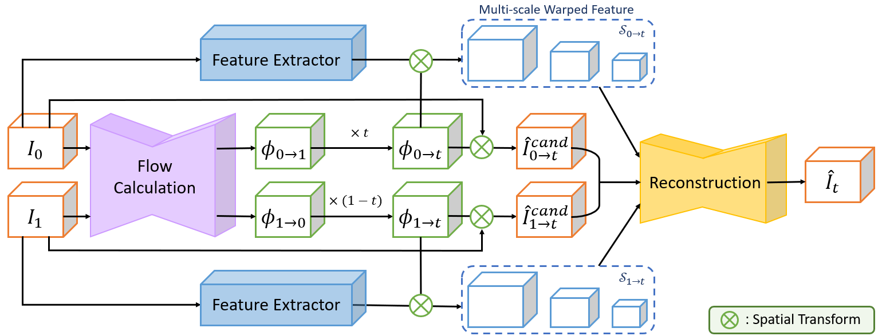
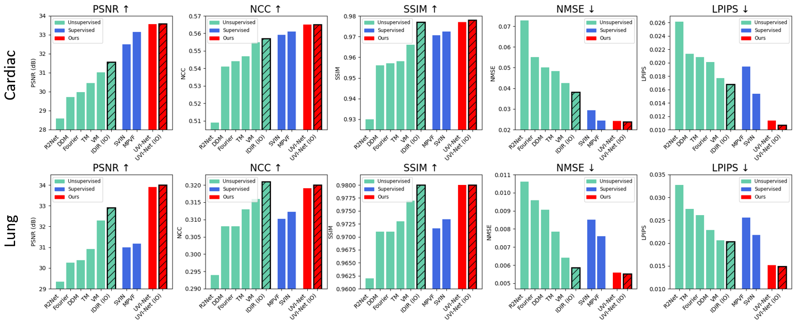
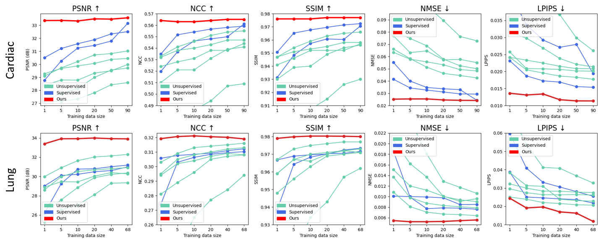

# Data-Efficient Unsupervised Interpolation Without Any Intermediate Frame for 4D Medical Images (CVPR 2024)

[](https://arxiv.org/abs/2404.01464)
> **Data-Efficient Unsupervised Interpolation Without Any Intermediate Frame for 4D Medical Images**<br>
> JungEun Kim*, Hangyul Yoon*, Geondo Park, Kyungsu Kim, Eunho Yang <br>

>**Abstract**: <br>
> 4D medical images, which represent 3D images with temporal information, are crucial in clinical practice for capturing dynamic changes and monitoring long-term disease progression. However, acquiring 4D medical images poses challenges due to factors such as radiation exposure and imaging duration, necessitating a balance between achieving high temporal resolution and minimizing adverse effects. Given these circumstances, not only is data acquisition challenging, but increasing the frame rate for each dataset also proves difficult. To address this challenge, this paper proposes a simple yet effective **U**nsupervised **V**olumetric **I**nterpolation framework, UVI-Net. This framework facilitates temporal interpolation without the need for any intermediate frames, distinguishing it from the majority of other existing unsupervised methods. Experiments on benchmark datasets demonstrate significant improvements across diverse evaluation metrics compared to unsupervised and supervised baselines. Remarkably, our approach achieves this superior performance even when trained with a dataset as small as one, highlighting its exceptional robustness and efficiency in scenarios with sparse supervision. This positions UVI-Net as a compelling alternative for 4D medical imaging, particularly in settings where data availability is limited.

<div align='center'>
    
</div>

### Quantitative Results 
<div align='center'>
    
    
</div>

### Qualitative Results (Compared with Top-3 Baselines)
<div align='center'>
  
   
</div>

## ⚒️ Requirements
### Installation
prerequisites: `python>=3.8` and `torch>=1.11`.

Install with `pip`:
```bash
pip install -r requirements.txt
```

### Datasets

To use this code, you will need to download the ACDC dataset and 4D-Lung dataset. You can download the dataset from the [ACDC website](https://humanheart-project.creatis.insa-lyon.fr/database/#collection/637218c173e9f0047faa00fb) and [4D-Lung website](https://www.cancerimagingarchive.net/collection/4d-lung/).

After downloading the dataset, place the data in the `dataset` directory as follows:
```bash
└── dataset
    ├── ACDC
    │   └── database
    │       ├── training
    │       │   ├── patient001
    │       │   │   ├── patient001_4d.nii.gz
    │       │   │   ├── patient001_frame01.nii.gz
    │       │   │   ├── patient001_frame01_gt.nii.gz
    │       │   │   ├── patient001_frame12.nii.gz
    │       │   │   ├── patient001_frame12_gt.nii.gz
    │       │   │   ├── MANDATORY_CITATION.md
    │       │   │   └── Info.cfg
    │       │   ├── patient002
    │       │   │       :
    │       │   └── patient100
    │       ├── testing
    │       │   ├── patient101
    │       │   │       :
    │       │   └── patient150
    │       └── MANDATORY_CITATION.md
    └── 4D-Lung
        ├── 100_HM10395
        │   ├── 09-15-1997-NA-p4-69351
        │   │             :
        │   └── 07-02-2003-NA-p4-14571
        ├── 101_HM10395
        │     :
        └── 119_HM10395
```

For the 4D-Lung dataset, you need to preprocess the data (e.g. bed removal, min-max scaling, cropping, resizing ...) with the following command:
```bash
python data_preprocess/lung_preprocess.py
```
Please note that we have enhanced this code since our submission to CVPR. These enhancements include improved bed removal and the refinement of fine-grained details, leading to better overall results. Consequently, all models, including our UVI-Net and baseline models, exhibit performance improvements of approximately 1.5 to 2.0 in terms of PSNR.

Additionally, we have made available for download both the version reported in our CVPR submission and a new version incorporating the updated code. You can access the preprocessed data through [google drive](https://drive.google.com/drive/folders/1o5w6dn4qN6EHbevO9JLrj6ej7VclaVbH?usp=sharing). Even if you download the version we have released, the data usage license should be checked from the [original website](https://www.cancerimagingarchive.net/data-usage-policies-and-restrictions/).

The final data structure should be as follows:
```bash
└── dataset
    ├── ACDC
    │   └── (same as above)
    ├── 4D-Lung
    │   └── (same as above)
    └── 4D-Lung-Preprocessed
        ├── 100_0
        │   ├── ct_100_0_frame0.nii.gz
        │   │             :
        │   └── ct_100_0_frame9.nii.gz
        ├── 100_1
        │     :
        └── 119_7
```

## 🏃‍♀️ Running the code
### Training

In order to train UVI-Net, run the following script:
```bash
python train.py --dataset cardiac
python train.py --dataset lung
```

### Inference

In order to perform inference, run the following script:
```bash
python evaluate.py --dataset cardiac
python evaluate.py --dataset lung
```

## Citation

If you make use of our work, please cite our paper:

```bibtex
@inproceedings{kim2024data,
  title={Data-Efficient Unsupervised Interpolation Without Any Intermediate Frame for 4D Medical Images},
  author={Kim, JungEun and Yoon, Hangyul and Park, Geondo and Kim, Kyungsu and Yang, Eunho},
  booktitle={Proceedings of the IEEE/CVF Conference on Computer Vision and Pattern Recognition},
  pages={11353--11364},
  year={2024}
}
```
